  

 

  

 

  <b>Cyber Security × AI</b> · Builder of
  <a href="https://github.com/vanchungnguyxn/blue-team-toolkits">Blue-Team Toolkit</a>,
  <a href="https://github.com/vanchungnguyxn/SecuWeave">SecuWeave</a> &amp;
  <a href="https://github.com/vanchungnguyxn/k8s-rag-observability">RAG / observability</a>
    
  Defensive tooling meets applied AI — threat detection, integrity monitoring,
   
  SAST+explain pipelines, RAG systems, and agent / prompt labs.

 

---

 

  <h3>✦ Cyber × AI Focus</h3>
  

    Where security engineering intersects with models, agents, and retrieval systems.
  

<table>
  <tr>
    <td width="50%" valign="top">
      <h3><a href="https://github.com/vanchungnguyxn/SecuWeave">SecuWeave</a></h3>
      
Hybrid <b>SAST + explain / fix</b> — security scanning with LLM-assisted remediation, wired into GitHub Actions CI.

      <code>AI · SAST · CI/CD</code>
    </td>
    <td width="50%" valign="top">
      <h3><a href="https://github.com/vanchungnguyxn/k8s-rag-observability">k8s-rag-observability</a></h3>
      
RAG pipeline on Kubernetes with observability hooks — retrieval, serving, and ops visibility for AI workloads.

      <code>RAG · K8s · Observability</code>
    </td>
  </tr>
  <tr>
    <td width="50%" valign="top">
      <h3><a href="https://github.com/vanchungnguyxn/pdf-scan-toolkit">PDF Scan Toolkit</a></h3>
      
Document ingestion toolkit for <b>Clinical RAG</b> demos — scan, parse, and feed PDFs into retrieval flows.

      <code>RAG · NLP · Python</code>
    </td>
    <td width="50%" valign="top">
      <h3><a href="https://github.com/vanchungnguyxn/Day04-E403-Prompt-Engineering-Tool-Calling-Labs">Prompt &amp; Tool-Calling Labs</a></h3>
      
Hands-on labs for prompt engineering and tool calling — building blocks for agentic / AI product work.

      <code>Agents · Prompting · Tools</code>
    </td>
  </tr>
</table>

 

---

 

  <h3>✦ Featured — Defense</h3>

<table>
  <tr>
    <td colspan="2" align="center">
      <h3><a href="https://github.com/vanchungnguyxn/blue-team-toolkits">Blue-Team Toolkit</a></h3>
      
Live packet capture · threat detection · Slack / Telegram alerts

      
    </td>
  </tr>
  <tr>
    <td width="50%" align="center" valign="top">
      <h3><a href="https://github.com/vanchungnguyxn/File-Integrity-Monitor--FIM-">File Integrity Monitor</a></h3>
      
SHA-256 baseline · watch mode · HTML reports

      
    </td>
    <td width="50%" align="center" valign="top">
      <h3><a href="https://github.com/vanchungnguyxn/message-broadcaster">Message Broadcaster</a></h3>
      
Java UDP / SSE · GUI server → web client

      
    </td>
  </tr>
</table>

 

---

 

  <h3>✦ Metrics</h3>
  
  
  

 

  <h3>✦ Stack</h3>
  
    
  <code>Cyber</code> blue-team · FIM · packet capture · CI security
  &nbsp;·&nbsp;
  <code>AI</code> RAG · agents · prompt / tool-calling · SAST+LLM

 

  <h3>✦ Contributions</h3>
  

 

---

 

  <a href="mailto:ngv.chungg@gmail.com">Email</a>
  ·
  <a href="https://facebook.com/vchunn">Facebook</a>
  ·
  <a href="https://discord.com/users/411648657377722370">Discord</a>
  ·
  <a href="https://t.me/vnchungg">Telegram</a>
  ·
  <a href="https://github.com/vanchungnguyxn">GitHub</a>

